# Internet Banking System

> CS 5610 Group Project – Introduction to Cloud Computing | Instructor: Dr. Jun Wang

The Online Banking System Project in PHP focuses mainly on online transactions, accounts, and much more. To be more precise, the system helps to keep track of all customers' information along with their transaction details. Also, the system displays all the available analytics. In addition, the system allows adding bank accounts too. Evidently, this project contains an admin panel with a customer panel. Highlighting the features of this banking system project in PHP, it contains every feature for the management side of things. In an overview of this web application, a customer can register themselves and log into the system. In this project, customer registration does not mean opening/creating bank accounts. That portion of work is to be done manually using the system.

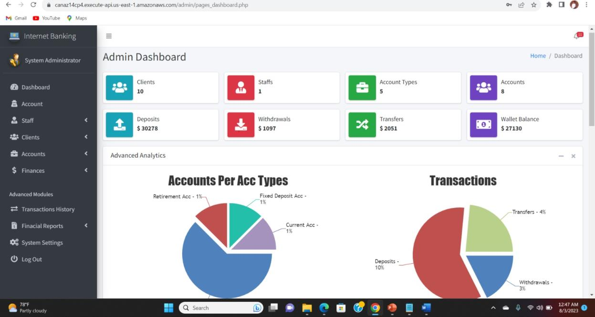

---

## Table of Contents

- [Customer Panel](#customer-panel)
- [Finance Section](#finance-section)
- [Transaction History and Financial Reports](#transaction-history-and-financial-reports)
- [Admin Panel](#admin-panel)
- [Staff and Client Management](#staff-and-client-management)
- [Accounts Section](#accounts-section)
- [Notification and Finance](#notification-and-finance)
- [Staff Panel](#staff-panel)
- [Available Features](#available-features)
- [Screenshots](#screenshots)
- [ERD](#erd)
- [Tech Stack](#tech-stack)
- [Project Structure](#project-structure)
- [Setup](#setup)
- [Default Login Credentials](#default-login-credentials)
- [Deployment on AWS](#deployment-on-aws)

---

## Customer Panel

Under the customer panel, the users can apply for banking accounts. Which allows them to use the features of this online banking system. In order to open an account, he/she has to select the type of account and name of the account. With this, the system automatically displays interest rates depending on the user's selection of account type. Also, the account numbers are generated automatically. In addition to that, one customer can have more than one bank account for this online banking project. Each and every customer will have their own respective dashboards that represent their overall records and analytics. Rest, the users can update, and complete their profiles. And also update their passwords.

## Finance Section

There are four different categories available for the users of this banking system project. They are Deposits, Withdrawals, Transfers, and Balance inquiries. To deposit some sum into existing accounts, the user first must select any one of the existing bank accounts. Then, he/she must provide the total amount to be deposited and that's it, that's all we have to do in order to manage deposit transactions. The procedures are the same for the withdrawal as mentioned earlier. To transfer money, the user has to provide an amount and select the account number of the customer. Here, the system automatically displays the name of the customer's account and account holder after selecting the receiver's account number. With this, a user can easily transfer money to another account.

The users can check their overall balance, the system lists out all the important details related to it as well. Speaking of that, this section clearly shows the total amount deposited, withdrawn, and transferred. Not just that, but this section works like a whole customer profile as it helps to outline all the activities of the customer as well as his/her information. In addition to that, the user can also print out their balance sheet.

## Transaction History and Financial Reports

After all those finance portions, the system records each transaction. From the transaction history section, the system lists all the detailed transactions. Speaking of detailed history, the system shows all the details such as transaction code, account number, type, amount, account holder, amount, date, and time. Regarding financial reports, it holds several sections. That includes reports on withdrawals, deposits, and transfers. Under the withdrawal reports section, the system lists a few important details. Such as transaction codes, account number, amount, account holder's name, and timestamp. And the same goes for the deposits section. On the other side, the transfer section lists out sender and receiver's account, amount, and code with date and time. Additionally, all these sections have a quick search function.

## Admin Panel

An admin has full control over the system. He/she can manage customers, users, products, and so on. Here, each and every section has its own respective details such as name, and other important details. From the admin panel, an administrator can view overview figures of total deposits, withdrawals, transfers, and wallet balances. On top of that, the system also generates advanced analytics using pie charts. Speaking of that, the analytics highlight two sections, accounts per account type and overall transactions. Also, the admin can view the latest transactions within the banking services. It includes several details such as transaction code, account number, type, amount, account holder, and timestamp.

## Staff and Client Management

An admin can manage clients as well as staff members' records directly by filling up the required forms. During the staff registration, an admin must provide details such as full name, email, contact number, gender, and a picture. With these simple steps, the system allows the users to create login details as well. Similarly, the administrator can also manage client members for the system. For adding a client member, the user must provide a name, contact, id number, email, address, and profile picture. Just like mentioned earlier, these simple steps allow users to create login details as well. In addition to it, both sections do contain search functionalities as well.

## Accounts Section

Talking about the accounts section, the administrator can add several account types and manage them. Account type simply refers to the type of bank account services he/she prefers using. So, to add a new account type, an admin has to provide the name of the account along with its rates per year, and a description. With this, the system automatically generates a new account category code for each account type before submission. To find records quickly, he/she can also make a search query. After setting up everything, the administrator can also proceed toward the opening of a bank account for each registered customer. From here, the user just must select any one from the available account type, and name and adjust the account number. This will result in the creation of an Internet banking account.

## Notification and Finance

The administrator can also overlook the finance sections. Such as withdrawals, deposits, and transfers of amounts from one customer to another. In fact, this portion works as a teller service for a bank. Where the customer wants to deposit a certain amount onto another one and the system user can easily complete the transactions. Moving towards the notification section, the system displays/alerts the administrator regarding ongoing system transactions and activities from the customers. The system users can simply click on the notification/bell icon to view the latest activity from the customer and even delete it to mark it as read.

## Staff Panel

On the other hand, staff members can contribute to several processes in this whole flow of the Internet banking system. A staff member can view overall transactions made within the banking services as well as total deposits, withdrawals, transfers, and bank accounts. In addition to it, the system users can manage client members, bank accounts, and finances. All the steps of the management are the same as mentioned above in the admin section. On top of that, the employee members can view each account holder's transaction history along with their financial reports. And, the staff members can view notifications for all the system activity just as mentioned earlier.

---

## Available Features

1. Admin Panel
2. Staff Panel
3. Customer Panel
4. Account Management
5. Deposit/Withdraw Amount
6. Transfer Amount
7. Transaction History
8. Activity Notifications
9. Check Account Balance
10. Print Account Balance
11. Deposit Report
12. Withdrawal Report
13. Transfer Report
14. View Overall Wallet Balance
15. View Analytics
16. Staff Management
17. Customer Management
18. System Settings

---

## Screenshots

### Admin Dashboard


### Staff Dashboard

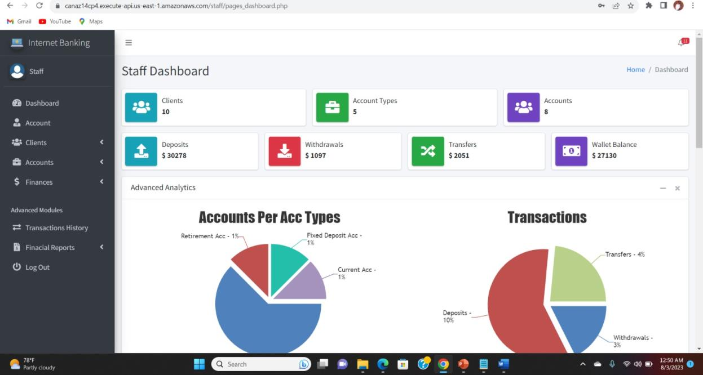

### Client Dashboard

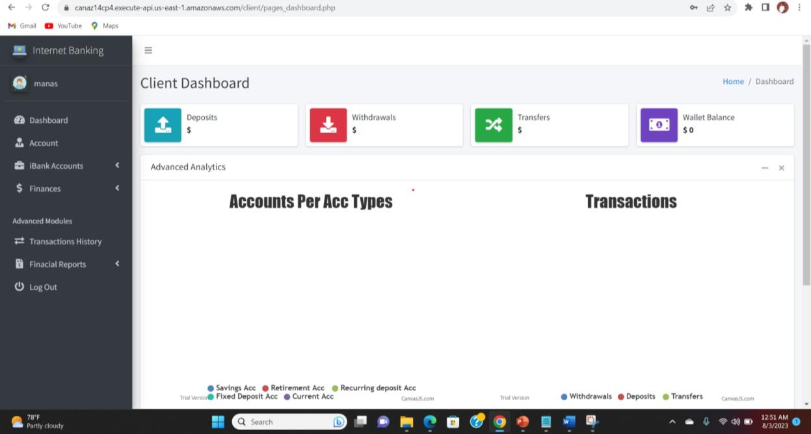

---

## ERD

The Entity-Relationship Diagram (ERD) is a vital component of the Online Banking System project in PHP as it visually represents the database structure and the relationships between various entities. The ERD serves as a blueprint for the database design and helps in understanding the data flow within the application. In this project, the ERD is constructed using the given table names: `account_types`, `transactions`, `systemsettings`, `staff`, `admin`, `clients`, `notifications`, and `bankaccounts`.

The ERD for the Online Banking System project consists of interconnected entities that play specific roles in the functioning of the system:

### 1. Clients
Represents the customers of the bank who can register and log into the system. Contains attributes like `client_id`, `name`, `email`, and contact information.

### 2. Bank Accounts
Responsible for storing details about the bank accounts created for each client. Includes attributes such as `account_id`, `account_number`, `balance`, and `account_type_id` (a foreign key referencing the `account_types` table).

### 3. Account Types
Stores different types of bank accounts available in the system. Contains attributes like `account_type_id` and `account_type_name`.

### 4. Transactions
Keeps track of all the transactions made by the clients. Includes attributes such as `transaction_id`, `transaction_date`, `amount`, `description`, and the `account_id` (a foreign key referencing the `bankaccounts` table).

### 5. Staff
Represents the bank staff members with access to the system's admin panel. Contains attributes like `staff_id`, `name`, and `role`.

### 6. Admin
Stores information about the system administrators. Includes attributes like `admin_id`, `name`, and contact details.

### 7. Notifications
Responsible for managing notifications sent to clients and staff. Includes attributes like `notification_id`, `message`, `recipient_id`, and `is_read` (to track if the notification has been read or not).

### 8. System Settings
Stores various settings and configurations for the system. Includes attributes like `setting_id`, `setting_name`, and `setting_value`.

The ERD visually illustrates how these entities are connected through relationships such as one-to-one, one-to-many, and many-to-many, representing how data flows between them. For example, a client can have multiple bank accounts (one-to-many relationship), and each bank account can have multiple transactions (one-to-many relationship). Additionally, staff and administrators have distinct roles and relationships with clients, transactions, and notifications.

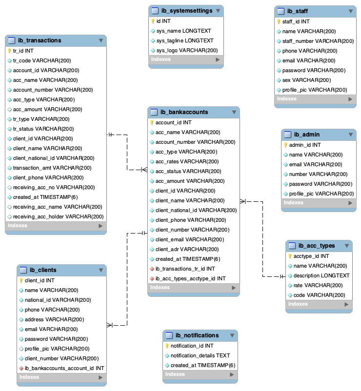

---

## Tech Stack

- **Backend:** PHP
- **Database:** MySQL
- **Frontend:** HTML, CSS, Bootstrap, JavaScript

---

## Project Structure

```
Online_Banking_System/
├── index.php                  # Entry point
├── admin/                     # Admin portal
│   ├── conf/                  # Config & auth
│   ├── dist/                  # Assets (CSS, JS, images)
│   ├── plugins/               # Third-party libraries
│   └── pages_*.php            # Admin pages
├── staff/                     # Staff portal
│   ├── conf/
│   ├── dist/
│   ├── plugins/
│   └── pages_*.php
├── client/                    # Client portal
│   ├── conf/
│   ├── dist/
│   ├── plugins/
│   └── pages_*.php
├── dist/                      # Shared assets
├── assets/screenshots/        # Project screenshots
└── DATABASE FILE/             # SQL dump (internetbanking.sql)
```

---

## Setup

1. Install PHP and MySQL (or use XAMPP/MAMP)
2. Import `DATABASE FILE/internetbanking.sql` into your MySQL server
3. Configure database credentials in:
   - `admin/conf/config.php`
   - `staff/conf/config.php`
   - `client/conf/config.php`
4. Serve the project root with a PHP-compatible web server:
   ```bash
   php -S localhost:8080
   ```
5. Visit `http://localhost:8080/` in your browser

---

## Default Login Credentials

| Role  | Email            | Password  |
|-------|------------------|-----------|
| Admin | admin@mail.com   | test@123  |
| Staff | staff@mail.com   | test@123  |

> **Note:** Change default credentials before deploying to production.

---

## Deployment on AWS

The project is deployed on Amazon Web Services (AWS) utilizing various services to ensure a reliable and scalable deployment. The main AWS services used are:

- **Amazon RDS** — Stores the project's data in a MySQL database. Provides a managed database service with high availability, automatic backups, and scalability.
- **Amazon EC2** — Hosts the PHP application. Provides virtual servers in the cloud for easy deployment and management.
- **Elastic IP** — Allocated to the EC2 instance to provide a static public IP address for consistent access.
- **Security Group** — Configured to control inbound and outbound traffic to the EC2 instance. Only necessary ports are allowed.
- **API Gateway** — Used to mask the EC2 IP address and create an HTTP API integrated with the EC2 instance endpoint.

---

### Step 1: Create an Amazon RDS Instance

1. Go to the AWS Management Console and navigate to the Amazon RDS service.
2. Click on "Create Database" and choose "MySQL" as the database engine.
3. Select the desired version of MySQL and configure the instance settings (DB instance identifier, username, password).
4. Specify the allocated storage, backup settings, and maintenance preferences.
5. Ensure the RDS instance is launched in the same VPC as your EC2 instance for secure communication.
6. Click "Create Database" to create the RDS instance.

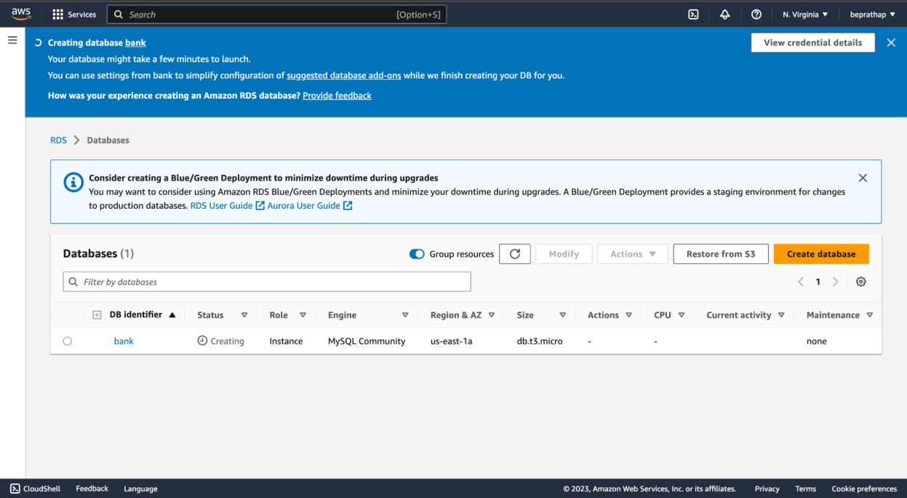

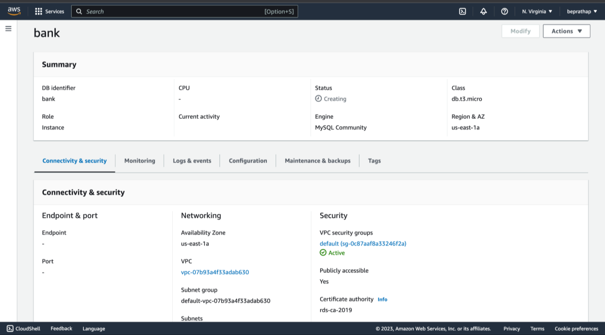

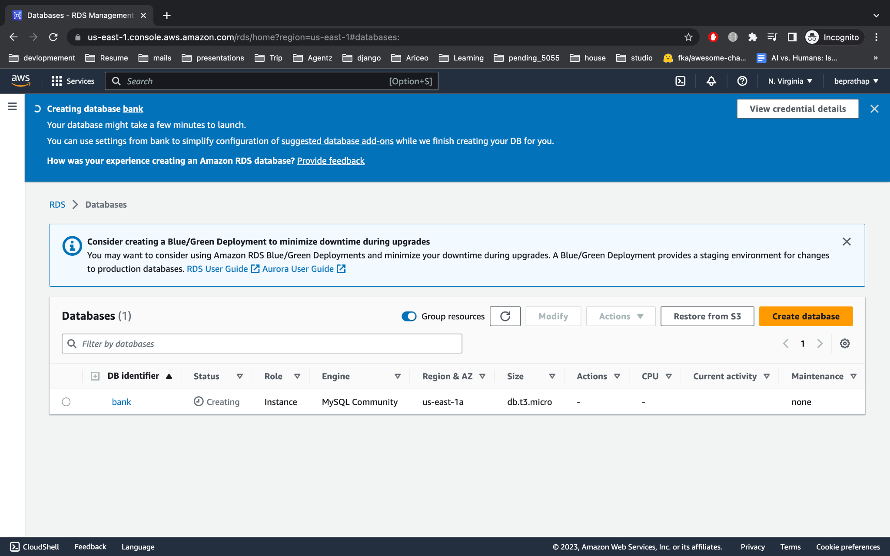

---

### Step 2: Launch an Amazon EC2 Instance

1. Go to the AWS Management Console and navigate to the Amazon EC2 service.
2. Click on "Launch Instance" and choose a suitable Amazon Machine Image (AMI) with PHP pre-installed.
3. Select the desired instance type based on the expected traffic and resource requirements.
4. Configure the instance details (number of instances, network settings, storage).
5. Add tags to your EC2 instance for better management and identification.
6. Configure the security group to allow SSH access (port 22) and HTTP/HTTPS access (ports 80 and 443).
7. Review the instance configuration and click "Launch" to create the EC2 instance.

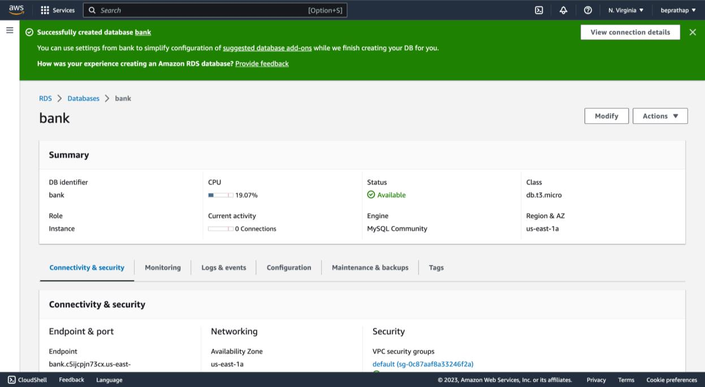

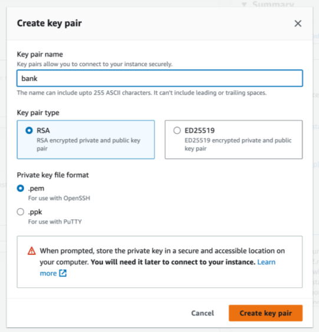

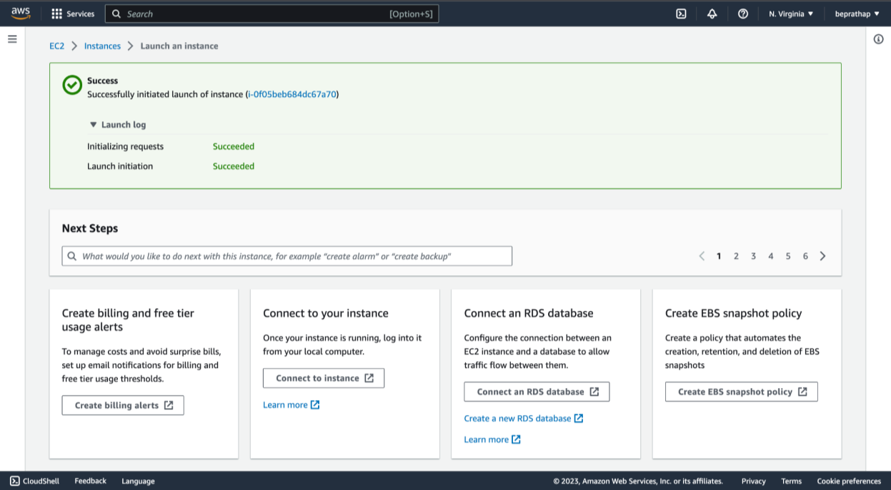

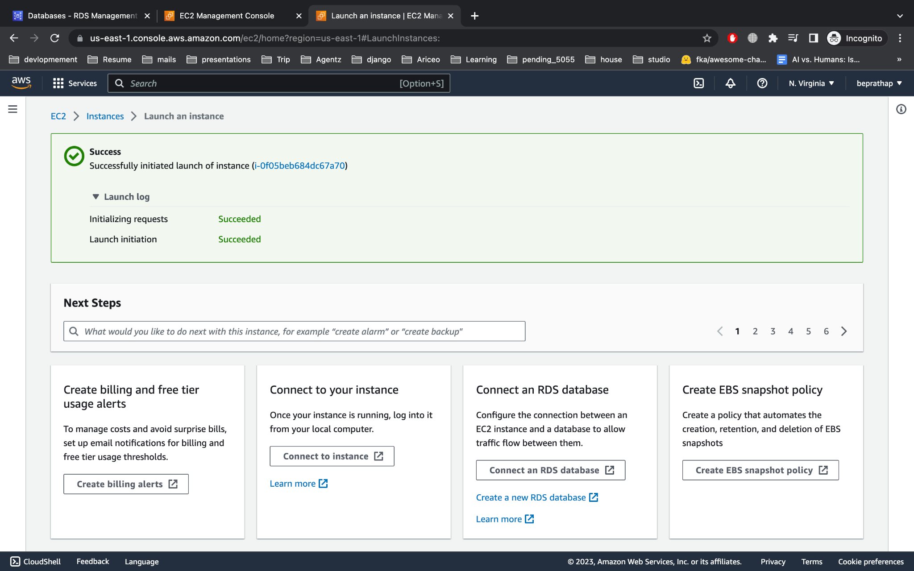

---

### Step 3: Allocate an Elastic IP

1. In the AWS Management Console, go to the Elastic IPs section under the EC2 service.
2. Click "Allocate new address" and then "Allocate" to get a new Elastic IP address.
3. Select the newly allocated IP address from the list and click "Actions" > "Associate IP address."
4. Choose the EC2 instance you created earlier and associate the Elastic IP with it.

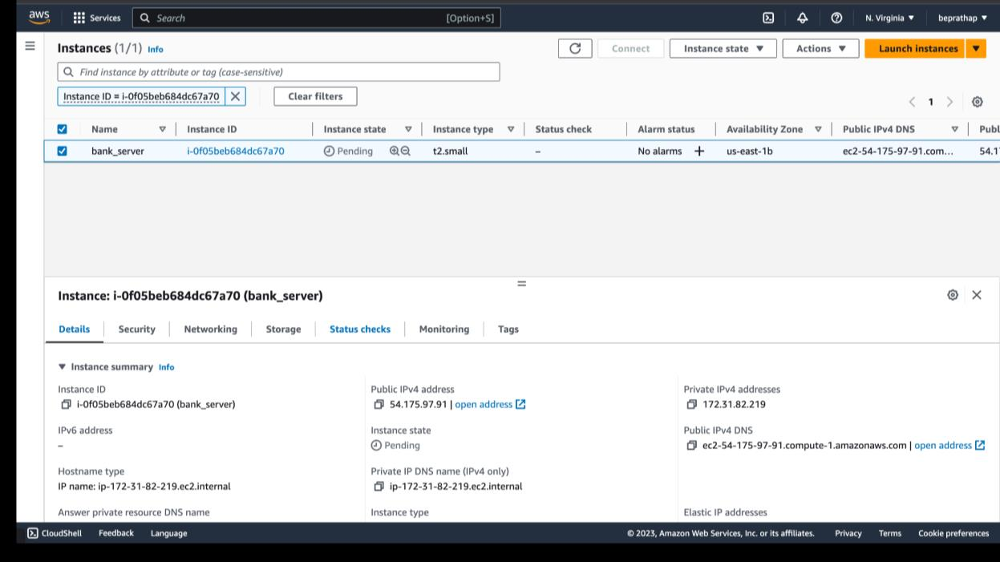

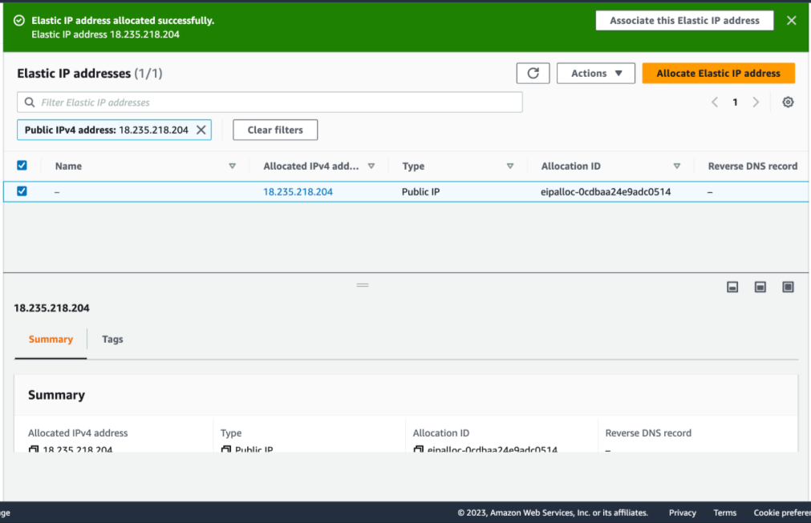

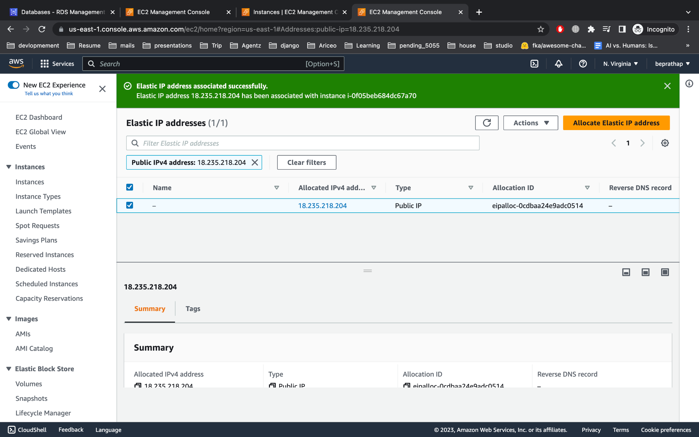

---

### Step 4: Configure the Security Group

1. Go to the EC2 Dashboard, click on "Security Groups" in the left sidebar, and select the security group associated with your EC2 instance.
2. In the "Inbound rules" tab, edit the existing rule to allow all inbound traffic (0.0.0.0/0) on all ports. Alternatively, specify only the required ports for your application.
3. Ensure that outbound traffic is allowed as well (by default, it is allowed).

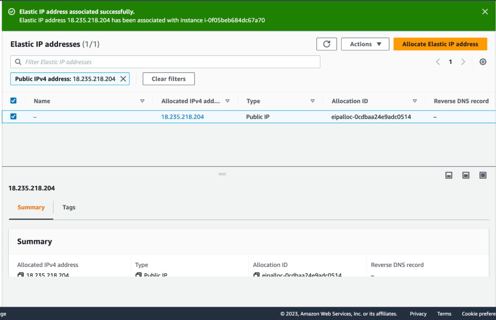

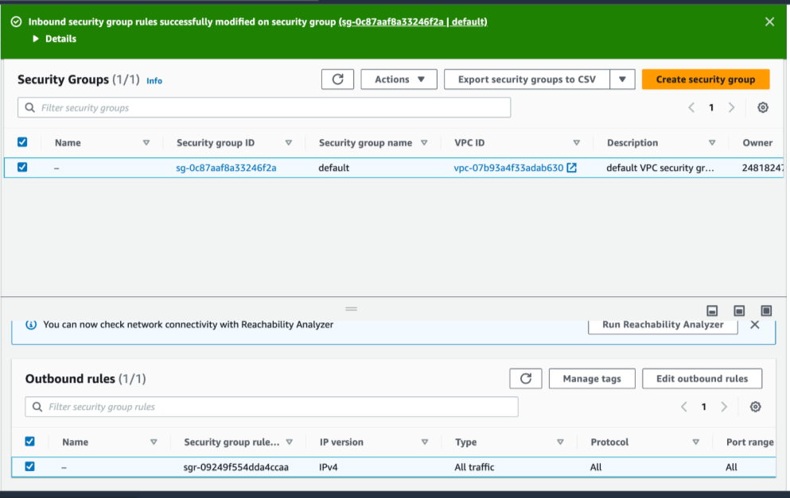

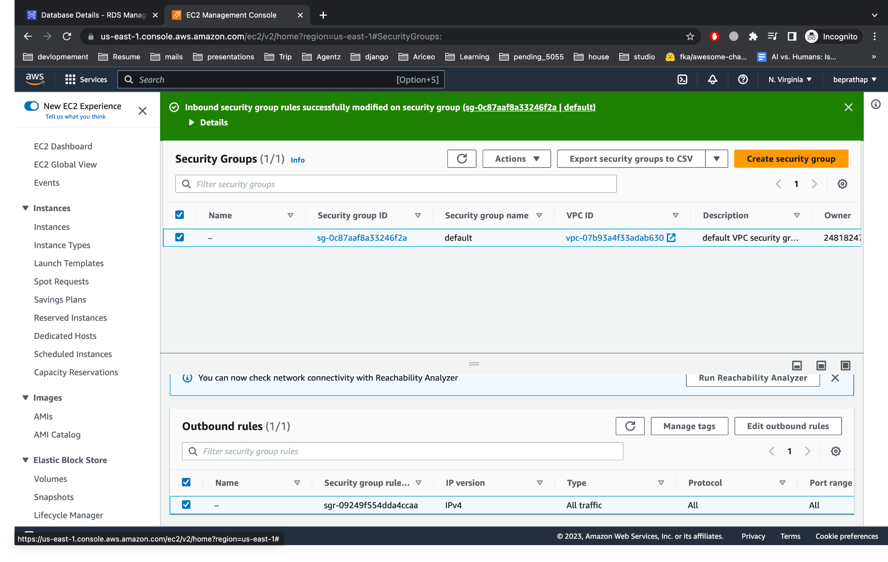

---

### Step 5: Deploy the PHP Project

1. Connect to your EC2 instance using SSH. You can find the public IP address or Elastic IP address in the EC2 Dashboard.
2. Upload your PHP project files to the EC2 instance using tools like SCP or SFTP.
3. Install the required dependencies for your PHP application, such as Apache, PHP modules, and MySQL client.
4. Configure the Apache web server to serve your PHP application. Set up virtual hosts and specify the document root.
5. Update the PHP configuration with appropriate settings, such as database connection details and other application-specific configurations.
6. Ensure that your PHP application is accessible on the server's public IP address or domain name.

---

### Step 6: Set up Database Connection

1. On your EC2 instance, update the PHP application code to use the RDS endpoint as the database server instead of localhost or IP.
2. Update the database credentials in the PHP code to match the RDS instance's username and password.

---

### Step 7: Configure API Gateway

1. Go to the AWS Management Console and navigate to the API Gateway service.
2. Click "Create API" and choose "HTTP API" for a lightweight and cost-effective solution.
3. Configure the HTTP API settings, such as name and description.
4. Create a new integration under the "Routes" section and choose "HTTP" as the integration type.
5. Enter the EC2 instance's public IP address or domain name as the integration endpoint.
6. Deploy the API to a stage and obtain the API's endpoint URL.

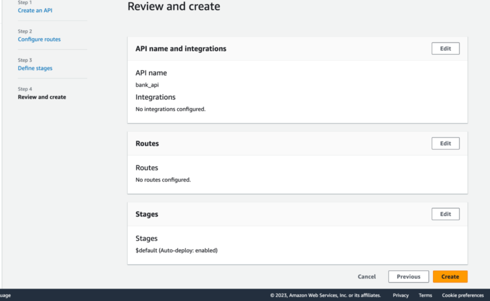

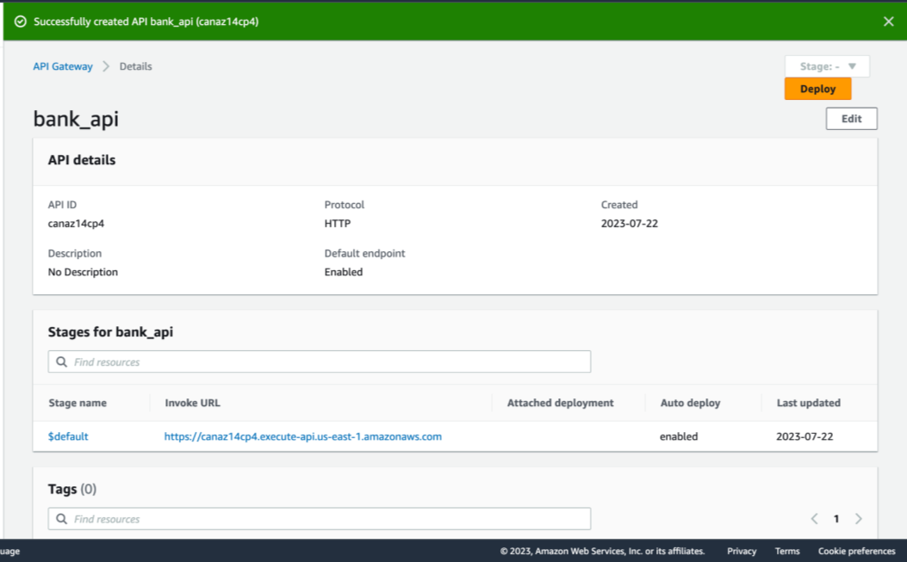

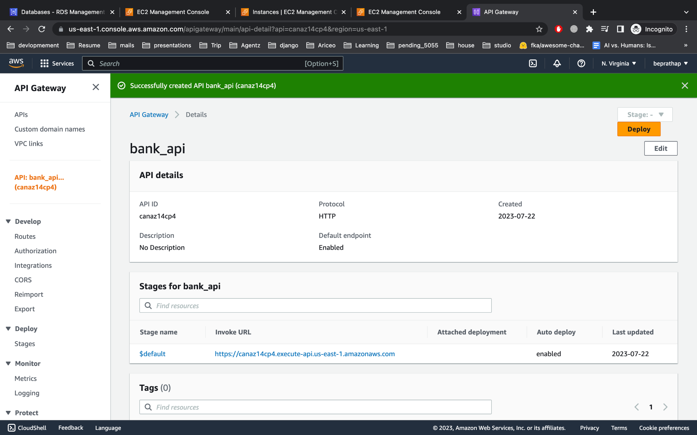

---

### Step 8: Route Traffic through API Gateway

1. Update your web application to make API calls using the endpoint URL provided by API Gateway instead of the direct EC2 instance URL.
2. Verify that your web application works correctly and is accessible through the API Gateway endpoint.

---

### Key Learnings

We have not only gained hands-on experience with AWS services but also deepened our understanding of cloud architecture best practices. AWS labs helped us in the deployment of our web application using the services available on AWS.

### Difficulties Faced

We faced difficulties mainly due to the lack of knowledge of cloud technologies initially and in selecting the right services for the right function. But over the period we made use of AWS Academy in understanding each service.
